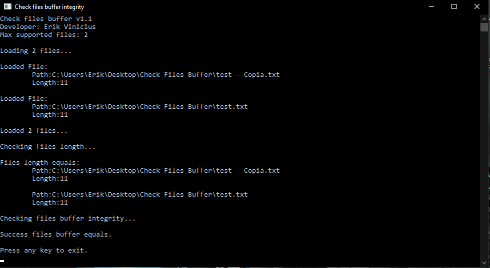
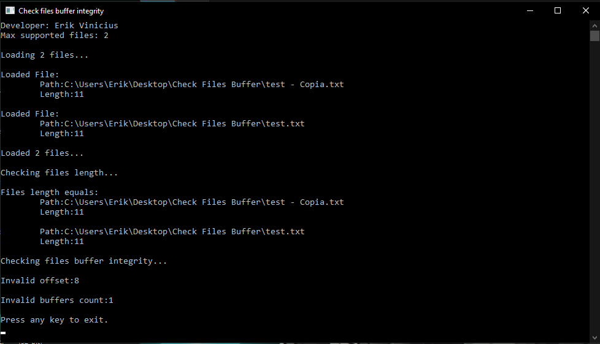
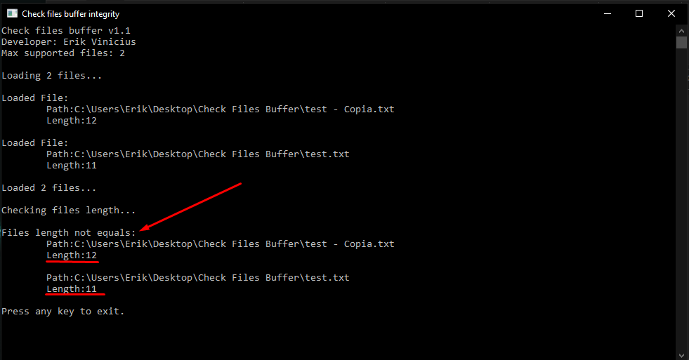

# Check Files Buffer
tool created to check if the buffer of two files are equal 
it checks the entire file buffer, checking for invalid byte by byte and returning the offset from where the files are different

## Example:
 Creating a text file and typing anything inside, and making the copy of the same file and throwing the two in the tool through drag and drop the return will be <a href="#sucess" >Success<a/>

## Results:

### Success

  
If everything goes OK it will display a success message on the console.

  

### Buffer Invalid

  
It will check that all bytes of the files are the same. otherwise it will display this error message.

  

### Length Invalid

  
It will check the file sizes to see if they are the same, otherwise it will display the following error message.

  

